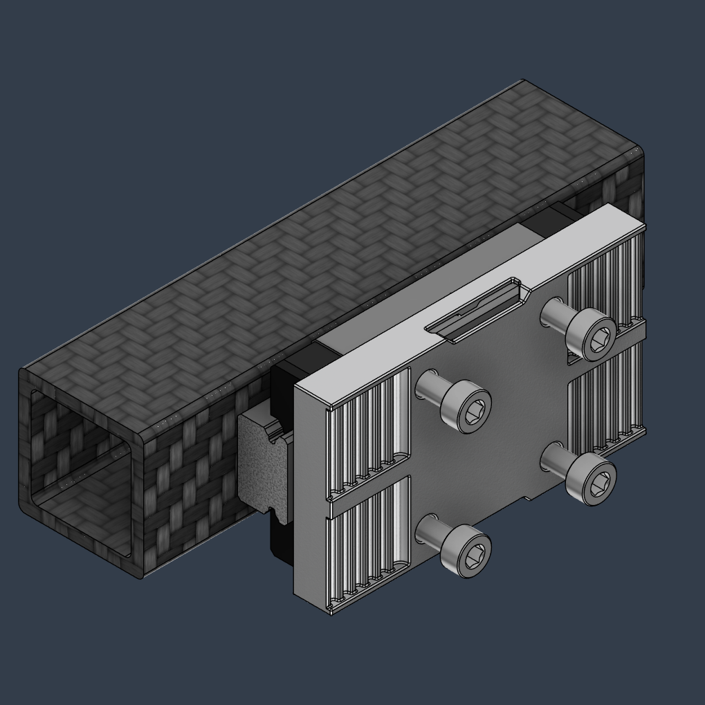
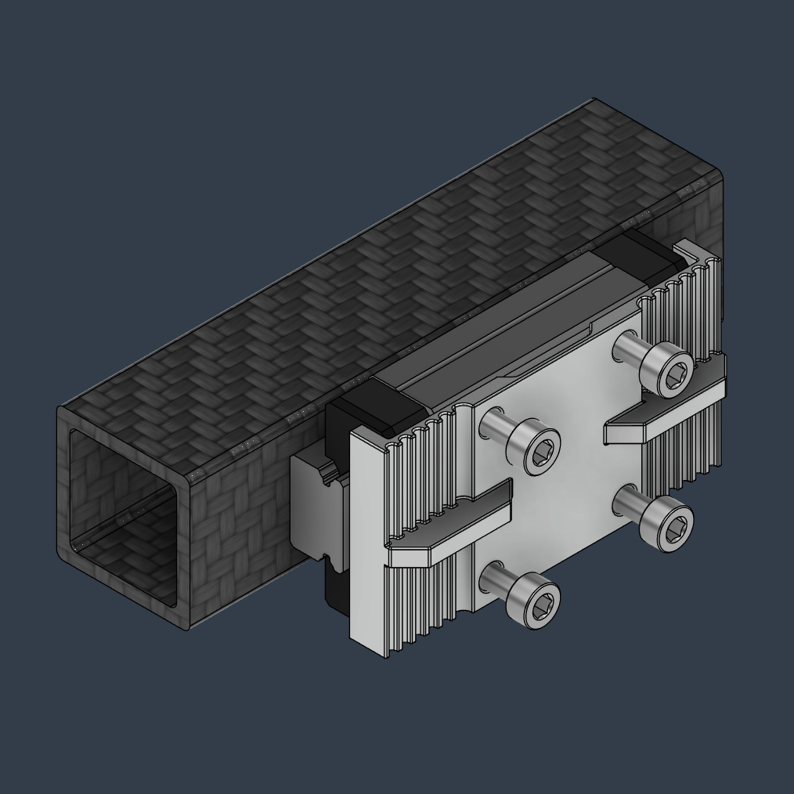

#  Monolith SLM Belt Clamps

I ended up making 2 types of belt clamps with different clearance benefits. I can't wait to see what implementations you guys come up with!

The Monolith Toolhead currently uses a custom version of the Type 1 clamp (as seen in the pic).

https://github.com/CloakedWayne/MISC/tree/main/Monolith_SLM_belt_clamps

> Members Area post from January 29, 2025.

